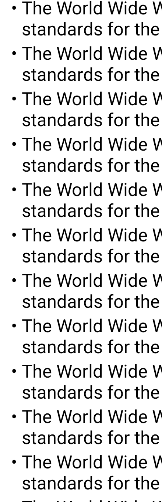
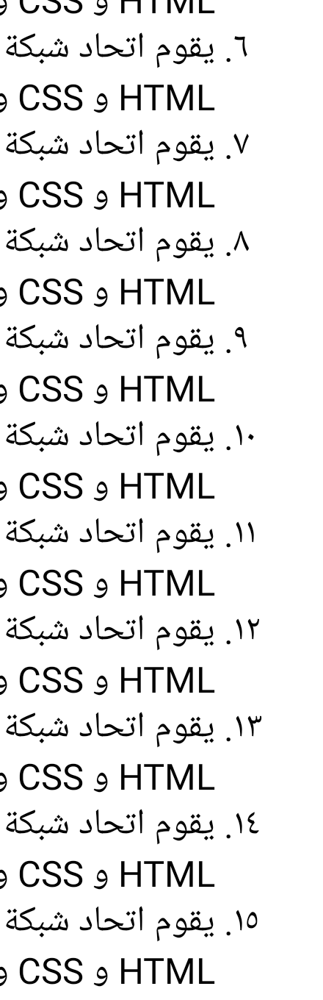
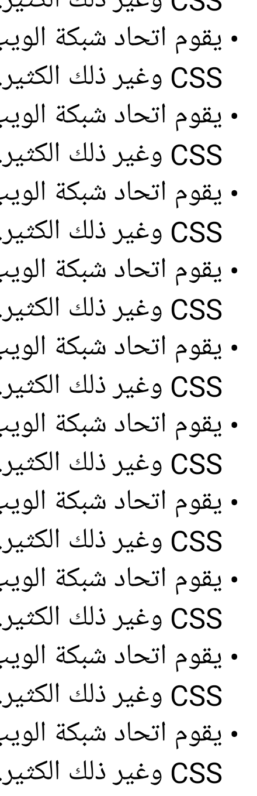

<h1 align="center">@jsamr/react-native-li</h1>

<p align="center">
  <a href="https://www.npmjs.com/package/@jsamr/react-native-li"
    ></a>
  <a href="https://semver.org/spec/v2.0.0.html"
    ></a>
  <a href="https://codecov.io/gh/jsamr/react-native-li?flag=react-native-li"
    ></a>
  <a
    href="https://github.com/jsamr/react-native-li/actions?query=branch%3Amaster+workflow%3Aexample-path"
    ></a>
  <a href="https://www.npmjs.com/package/@jsamr/react-native-li">
    
  </a>

</p>

<p align="center">
  A pure-JavaScript React Native component to render CSS3 compliant ordered and unordered lists.<br><br>
  Supports <a href="https://github.com/jsamr/react-native-li/tree/master/packages/counter-style/src/presets">more than 4 dozens numeric, alphabetic, symbolic and additive presets</a>, including<br>
  <b>Arabic</b> (numeric), <b>Persian</b>, <b>Thai</b>, <b>Hebrew</b>, <b>Roman</b>, <b>Katana</b>, <b>Latin</b>, disk, circle, square...<br>
  Plus, it has premium RTL support 🚀
</p>

<hr/>

```sh
npm add --save @jsamr/react-native-li @jsamr/counter-style
```

```sh
yarn add @jsamr/react-native-li @jsamr/counter-style
```

### Introduction

You must provide a counter style renderer from `@jsamr/counter-style` library
to the `counterRenderer` prop of [`MarkedList`](docs/react-native-li.markedlist.md) component. This library exports
dozens of presets as individual modules (see examples below) and also provides
an easy API to create custom counter styles. [Check the docs
here](https://github.com/jsamr/react-native-li/tree/master/packages/counter-style#readme).

[`MarkedList`](docs/react-native-li.markedlist.md) will render every children as a list item (li). If you want to
render items in a different container, you should instead use [`MarkedListItem`](docs/react-native-li.markedlistitem.md) in
combination with [`useMarkedList`](docs/react-native-li.usemarkedlist.md). The latter takes exactly the same props as `MarkedListItem` + a `length` prop corresponding to the number of list items to render. It returns base props for the `MarkedListItem` component.

[The full API including components props is available here](./docs/react-native-li.md).

### Examples

#### Lower Latin

<table width="100%">
<tr>
<td>

```jsx
import React from 'react';
import { ScrollView, StyleSheet, Text } from 'react-native';
import lowerLatin from '@jsamr/counter-style/presets/lowerLatin';
import MarkedList from '@jsamr/react-native-li';

export default function App() {
  return (
    <ScrollView style={{ flexGrow: 1 }}>
      <MarkedList counterRenderer={lowerLatin}>
        {[...Array(100).keys()].map((index) => (
          <Text key={index} style={{ flexShrink: 1 }}>
            The World Wide Web Consortium (W3C) develops international standards
            for the web and HTML, CSS, and more.
          </Text>
        ))}
      </MarkedList>
    </ScrollView>
  );
}
```

</td>
<td>  </td>
</tr>
</table>

#### Disc

<table width="100%">
<tr>
<td>

```jsx
import React from 'react';
import { ScrollView, StyleSheet, Text } from 'react-native';
import disc from '@jsamr/counter-style/presets/disc';
import MarkedList from '@jsamr/react-native-li';

export default function App() {
  return (
    <ScrollView style={{ flexGrow: 1 }}>
      <MarkedList counterRenderer={disc}>
        {[...Array(100).keys()].map((index) => (
          <Text key={index} style={{ flexShrink: 1 }}>
            The World Wide Web Consortium (W3C) develops international standards
            for the web and HTML, CSS, and more.
          </Text>
        ))}
      </MarkedList>
    </ScrollView>
  );
}
```

</td>
<td>  </td>
</tr>
</table>

#### Arabic + RTL

<table width="100%">
<tr>
<td>

```jsx
import React from 'react';
import { ScrollView, StyleSheet, Text } from 'react-native';
import arabicIndic from '@jsamr/counter-style/presets/arabicIndic';
import MarkedList from '@jsamr/react-native-li';

export default function App() {
  return (
    <ScrollView style={{ flexGrow: 1 }}>
      <MarkedList
        counterRenderer={arabicIndic}
        rtlLineReversed
        rtlMarkerReversed>
        {[...Array(100).keys()].map((index) => (
          <Text key={index} style={{ flexShrink: 1 }}>
            يقوم اتحاد شبكة الويب العالمية (W3C) بتطوير معايير دولية للويب و
            HTML و CSS وغير ذلك الكثير.
          </Text>
        ))}
      </MarkedList>
    </ScrollView>
  );
}
```

</td>
<td>  </td>
</tr>
</table>

#### Disc + RTL

<table width="100%">
<tr>
<td>

```jsx
import React from 'react';
import { ScrollView, StyleSheet, Text } from 'react-native';
import disc from '@jsamr/counter-style/presets/disc';
import MarkedList from '@jsamr/react-native-li';

export default function App() {
  return (
    <ScrollView style={{ flexGrow: 1 }}>
      <MarkedList counterRenderer={disc} rtlLineReversed rtlMarkerReversed>
        {[...Array(100).keys()].map((index) => (
          <Text key={index} style={{ flexShrink: 1 }}>
            يقوم اتحاد شبكة الويب العالمية (W3C) بتطوير معايير دولية للويب و
            HTML و CSS وغير ذلك الكثير.
          </Text>
        ))}
      </MarkedList>
    </ScrollView>
  );
}
```

</td>
<td>  </td>
</tr>
</table>

## API Reference

[See autogenerated docs here](./docs/react-native-li.md).

## Frequent Issues

### Marker box width is too wide

Width is approximated with the maximum marker string length in range, but letter widths may vary a lot depending on font and scripts. Use `computeMarkerBoxWidth` prop to customize width, or use `markerStyle` to override width.

### Text in list items overflows

Don't forget to add `flexShrink: 1` to your `Text` element.
